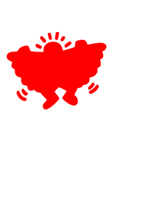

# svg2stl

This repository provides a script which takes as input an SVG such as this one:



It outputs an [STL file](https://www.wikiwand.com/en/STL_(file_format)) like this:


You can also see an interactive version [here](example.stl).

The resulting solid is a cuboid with holes in it. It essentially adds a third dimension to the SVG file. The purpose of the output STL is to be fed into a 3D printer. The end goal is to make a physical [stencil](https://www.wikiwand.com/en/Stencil) for artistic purposes.

## Installation

```sh
git clone https://github.com/MaxHalford/svg2stl
cd svg2stl
pip install -r requirements.txt
```

## Usage

You can generate an STL with the same name as the input file like this:

```sh
python svg2stl.py example.svg --thickness 4
```

The thickness is the distance between the solid's bottom and top.

An SVG is a sequence of geometric lines. When these lines are not straight, then points are interpolated along their trajectory. You can choose how many points to interpolate as so:

```sh
python svg2stl.py example.svg --definition 12
```

In addition to saving the result, you can show what the rendered solid looks like in a GUI:

```sh
python svg2stl.py example.svg --thickness 4 --show
```

Some SVGs have bogus instructions at the beginning of their path definition. For instance, the first three steps of [example_bogus.svg](example_bogus.svg) cause the rendering to fail. Skipping them does the trick:

```sh
python svg2stl.py example_bogus.svg --skip 3 --show
```

## How it works

- The SVG file is parsed into a sequence of steps thanks to [`svg.path`](https://github.com/regebro/svg.path).
- Each step is turned into 2D geometric coordinates by sampling from each step's parametric equation with [`numpy`](https://numpy.org/).
- Each coordinate is duplicated so that there are top and bottom coordinates.
- The coordinates are stitched together to define panes: a floor, a ceiling, and many walls.
- [`pygmsh`](https://github.com/nschloe/pygmsh) does the heavy lifting. It generates a mesh of triangles from the panes through [constrained Delaunay triangulation](https://www.wikiwand.com/en/Constrained_Delaunay_triangulation).

## Motivation

There are some websites out there that already do this. Like [this](https://svg2stl.com/), [this](https://activmap.github.io/svg-to-stl/), and [this](https://github.com/rcalme/svg-to-stl). But they're websites, and sometimes it's nice to be able to do this from the command line. Especially if you want to process many SVGs.

## License

The MIT License (MIT). Please see the [license file](LICENSE) for more information.
